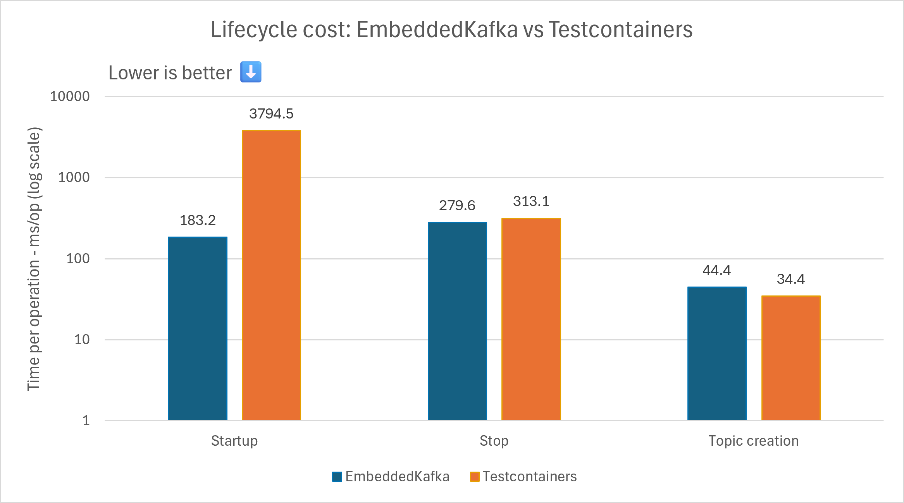
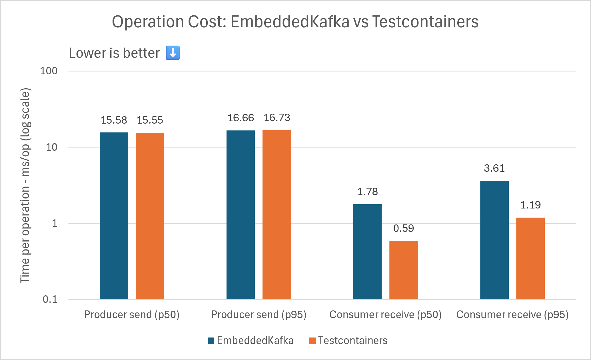
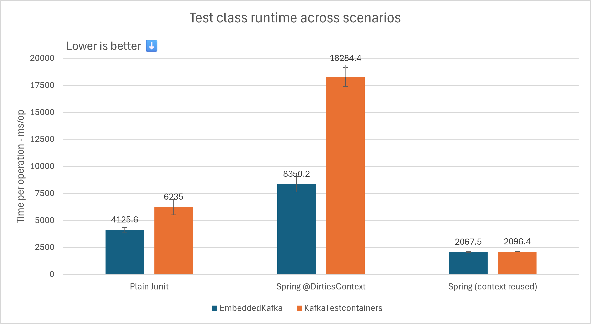

<!-- markdownlint-disable-file MD033 -->
<!-- markdownlint-disable-file MD041 -->
<div align="center"></div>

# JUnit KafkaTestcontainers: A JUnit extension for Kafka integration tests

[](https://opensource.org/licenses/Apache-2.0)
[](https://docs.oracle.com/javase/17/)

[](https://sonarcloud.io/summary/new_code?id=dynatrace-oss_junit-kafkatestcontainers)
[](https://sonarcloud.io/summary/new_code?id=dynatrace-oss_junit-kafkatestcontainers)

**junit-kafkatestcontainers** is a Java library that simplifies Kafka integration testing through a single configurable annotation. It works in both Spring and non-Spring JUnit5 projects, locally and in CI pipelines.

Compared to Spring's `EmbeddedKafka`, which pins you to the Kafka client version from your Spring release and ships a minimal broker, this library runs a real Kafka broker in a Docker container via [Testcontainers](https://testcontainers.com/), so you choose the version.

The annotation accepts configuration parameters, and the JUnit5 extension manages the container lifecycle for you. In a Spring context, the extension hooks into the Spring environment and resolves placeholders for both `@Value` injection and application.properties, with no additional wiring. In non-Spring projects it can be used without Spring test support.

## Table of Contents

- [Getting started](#getting-started)
  - [First steps](#first-steps)
  - [Environment Setup](#environment-setup)
  - [Usage](#usage)
  - [Configuration](#configuration)
- [Benchmark Results](#benchmark-results)
- [Verifying Release Artifacts](#verifying-release-artifacts)
- [License](#license)
- [Contributing](#contributing)
  - [Code Style](#code-style)
  - [Documentation](#documentation)
  - [Static Analysis](#static-analysis)
  - [Tests](#tests)
  - [Pull Requests](#pull-requests)
- [Disclaimer](#disclaimer)

## Getting Started

### First steps

To add the dependency `com.dynatrace.junit.kafkatestcontainers` to your Maven project, use the following:

````xml
<dependency>
  <groupId>com.dynatrace.junit.kafkatestcontainers</groupId>
  <artifactId>junit-kafkatestcontainers</artifactId>
  <version>0.1.0</version>
</dependency>
````

To add the dependency using Gradle (with Kotlin):

````kotlin
testImplementation(testFixtures("com.dynatrace.junit.kafkatestcontainers:junit-kafkatestcontainers:0.1.0"))
````

### Environment Setup

A running Docker daemon is required. Testcontainers picks it up automatically in most setups. The two most relevant variables are:

| Environment variable                   | Description                                                                                                                                                       |
|----------------------------------------|-------------------------------------------------------------------------------------------------------------------------------------------------------------------|
| `DOCKER_HOST`                          | Docker daemon socket. Testcontainers checks this first, then falls back to `/var/run/docker.sock`. Set it explicitly if your daemon runs on a non-default socket. |
| `TESTCONTAINERS_HUB_IMAGE_NAME_PREFIX` | Prefix prepended to all image pulls. Use this to redirect pulls to an internal registry or mirror (e.g. `registry.example.com/dockerhub-mirror/`).                |

These can also be set in `src/test/resources/testcontainers.properties` instead of as environment variables, which is useful for sharing settings across the team via version control:

```properties
docker.host=tcp://localhost:2375
hub.image.name.prefix=registry.example.com/dockerhub-mirror/
```

For the full list of supported configuration options see the [Testcontainers configuration reference](https://java.testcontainers.org/features/configuration/).

### Usage

#### Plain JUnit 5

Annotate your test class and inject `KafkaContainer` as a parameter, no framework needed:

```java
@KafkaTestcontainers(
    topics = @KafkaTestcontainers.Topic(name = "my-topic", partitions = 3)
)
class MyKafkaTest {

    @Test
    void myTest(KafkaContainer kafka) {
        String bootstrapServers = kafka.getBootstrapServers();
        // build producers/consumers using bootstrapServers
    }
}
```

The container starts once per test class and is torn down automatically. A Docker daemon must be running on the host. If multiple test methods need access, inject the `KafkaContainer` in a `@BeforeEach` instead.

#### Spring

Combine `@KafkaTestcontainers` with `@SpringBootTest`. The broker address is injected into the Spring context under `spring.kafka.bootstrap-servers` automatically. No manual wiring needed:

```java
@KafkaTestcontainers(
    topics = @KafkaTestcontainers.Topic(name = "my-topic")
)
@SpringBootTest
class MyKafkaTest {

    @Value("${spring.kafka.bootstrap-servers}")
    private String bootstrapServers;
}
```

Topic names support Spring property placeholders, so `${my.app.topic}` resolves from your test properties before the topic is created.

#### Migrating from `@EmbeddedKafka`

Replace the annotation and update the bootstrap property key. Everything else stays the same.

**Before:**

```java
@SpringBootTest
@EmbeddedKafka(
    topics = {"my-topic"}, partitions = 3
)
class MyKafkaTest {

    @Value("${spring.embedded.kafka.brokers}")
    private String bootstrapServers;
}
```

**After:**

```java
@SpringBootTest
@KafkaTestcontainers(
    topics = @KafkaTestcontainers.Topic(name = "my-topic", partitions = 3)
)
class MyKafkaTest {

    @Value("${spring.kafka.bootstrap-servers}")
    private String bootstrapServers;
}
```

### Configuration

All parameters are optional. The annotation works with zero configuration — a broker is started with default settings and no pre-created topics.

| Parameter           | Default                          | Description                                                                                                                                                                                              |
|---------------------|----------------------------------|----------------------------------------------------------------------------------------------------------------------------------------------------------------------------------------------------------|
| `topics`            | *(none)*                         | Topics to create before tests run. Each topic takes a `name` and an optional `partitions` count. Omitting `partitions` on a topic inherits the annotation-level `partitions` value.                      |
| `partitions`        | `1`                              | Default partition count for all topics. Applied to explicitly created topics that omit their own `partitions`, and set as the broker's `num.partitions` so auto-created topics use the same default.     |
| `version`           | Kafka client dependency version  | Broker version to run. Override to test against a specific or older broker version.                                                                                                                      |
| `bootstrapProperty` | `spring.kafka.bootstrap-servers` | Spring property key under which the broker address is registered. Override when your app uses a non-default key, e.g. when multiple Kafka clusters are configured. Has no effect in plain JUnit 5 tests. |

#### Setting a default partition count

Apply a default to all topics at once. Individual topics can override it; omitting `partitions` on a topic inherits the annotation-level value. The same value is also configured as the broker's `num.partitions`, so auto-created topics follow the same default:

```java
@KafkaTestcontainers(
    partitions = 3,
    topics = {
        @KafkaTestcontainers.Topic(name = "high-volume"),   // → 3 partitions (inherited)
        @KafkaTestcontainers.Topic(name = "commands", partitions = 1) // → 1 partition (override)
    }
)
class MyKafkaTest { }
```

#### Pinning the broker version

```java
@KafkaTestcontainers(version = "3.7.0")
@SpringBootTest
class LegacyBrokerCompatibilityTest { }
```

#### Custom bootstrap property (multiple clusters)

```java
@KafkaTestcontainers(bootstrapProperty = "spring.kafka.secondary.bootstrap-servers")
@SpringBootTest
class SecondaryClusterTest {

    @Value("${spring.kafka.secondary.bootstrap-servers}")
    private String bootstrapServers;
}
```

## Benchmark Results

JMH benchmarks comparing `@KafkaTestcontainers` against Spring's `@EmbeddedKafka` across lifecycle cost,
per-operation latency, and full test class runtime. Lower is better in all charts. EmbeddedKafka starts up
significantly faster (~183 ms vs ~3800 ms); once running, operation latency is comparable for producers and
Testcontainers is faster for consumers. With Spring context reuse, total test class runtime is nearly identical.

Benchmark sources are in [`src/jmh/java/`](./src/jmh/java/) and raw results are available at
[`benchmark_result/result.json`](./benchmark_result/result.json).







## Verifying Release Artifacts

You can verify release artifacts with [this key](https://keys.openpgp.org/search?q=CE49CDB72D85CD25) using the commands below.

```bash
# Import the key
gpg --keyserver hkps://keys.openpgp.org --recv-keys CE49CDB72D85CD25 # -> Michael Koepf (Dynatrace, Inc.) <michael.koepf@dynatrace.com>
# Verify the chosen artifact
gpg --verify <artifact to be verified>.jar.asc <artifact to be verified>.jar # -> gpg: Good signature from "Michael Koepf (Dynatrace, Inc.) <michael.koepf@dynatrace.com>"
```

## License

This project is licensed under [Apache-2.0 license](./LICENSE).

## Contributing

Contributions are welcome! Please follow these guidelines in addition to [these guidelines](https://github.com/dynatrace-oss/junit-kafkatestcontainers?tab=contributing-ov-file) before opening a pull request.

### Code Style

This project enforces the [Google Java Style Guide](https://google.github.io/styleguide/javaguide.html) via Checkstyle. Run `./gradlew checkstyleAll` to verify locally before pushing.

- **No `System.out`** — use a logger (enforced by ForbiddenApis)
- **Null safety** — annotate with `@org.jspecify.annotations.*`; NullAway is enabled at error severity for production code

### Documentation

Markdown files must pass markdownlint validation. A Docker daemon is required. Run `make markdownlint` to verify documentation locally before pushing.

### Static Analysis

The build runs ErrorProne and ForbiddenApis in addition to Checkstyle. Run the full check suite with:

```shell
./gradlew build buildHealth
```

### Tests

All changes must be covered by tests. Run tests with:

```shell
./gradlew test 
```

### Pull Requests

- Keep PRs small and focused — one concern per PR
- Summarize what changed and why in the PR description

## Disclaimer

> [!WARNING]
> This is an experimental project with limited support and provided as-is.
> It is not covered by standard Dynatrace commercial support.

For general questions or inquiries, please [open a GitHub issue](https://github.com/dynatrace-oss/junit-kafkatestcontainers/issues).
